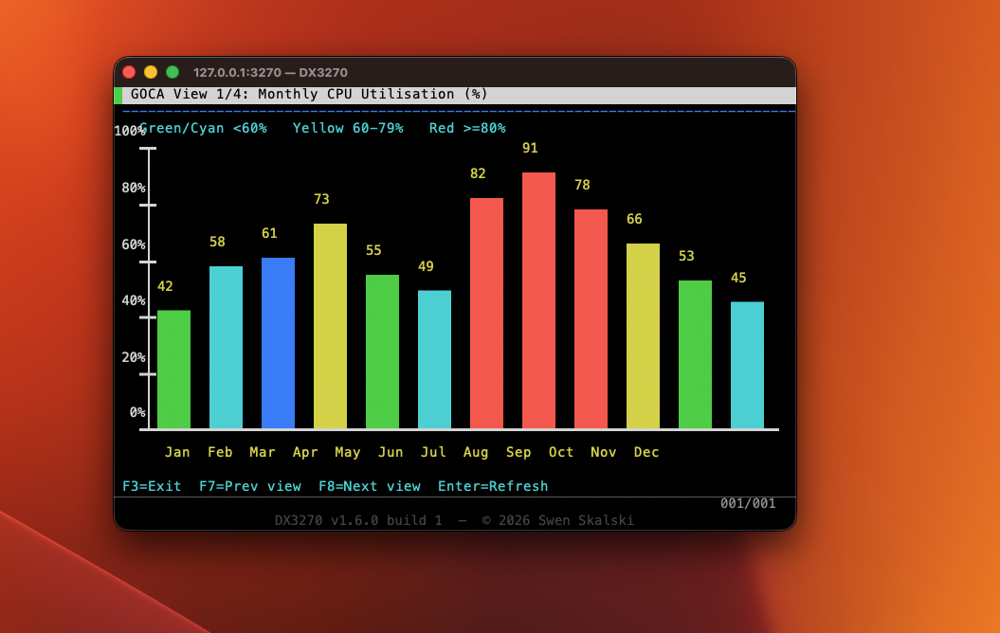
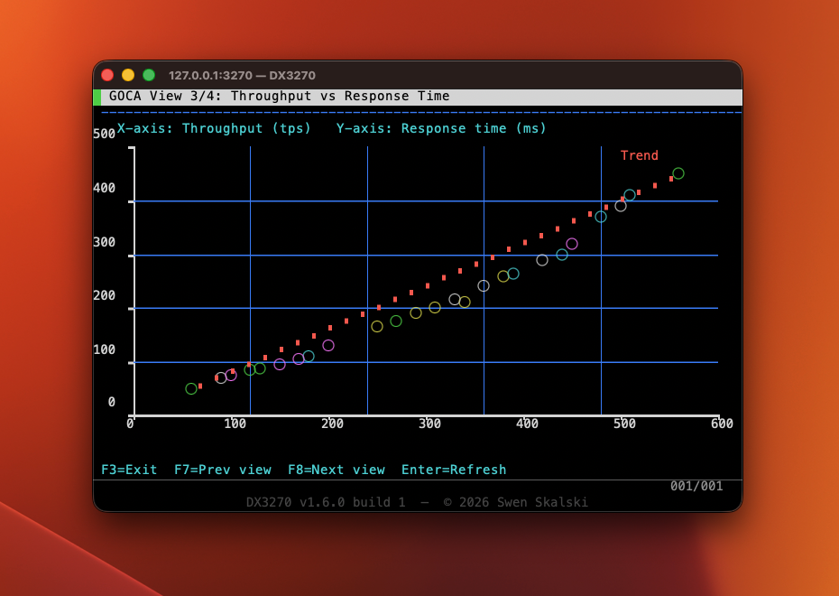

# DX3270 — Free TN3270 Terminal Emulator for macOS

A native macOS (ARM - Apple Silicon + Intel) TN3270/TN3270E terminal emulator for connecting to IBM Mainframes (z/OS, z/VM, z/VSE).  
Built entirely in C++ and Objective-C++ on top of native Cocoa, CoreText and OpenSSL.  
**No license fee. No Java. No X11.**

[](https://buy.stripe.com/7sY9AT3VMfKi53942m3VC05)

---

## Why this exists

If you work with IBM Mainframes on a Mac, you've probably noticed that every halfway-decent TN3270 terminal client costs money — sometimes a *lot* of money. We're talking $50–$100+ for software that essentially emulates a 1970s text terminal. One popular commercial option charges a recurring subscription just to type on a green screen. That's absurd.

There are a handful of free alternatives, but they either require Java (slow, ugly, a security nightmare), run inside X11 (no thanks), or are abandonware that hasn't been touched in a decade and breaks on every macOS release.

So I built one from scratch. Native Cocoa. Native CoreText rendering. OpenSSL for TLS. Full TN3270E negotiation including ISPF Query Reply so the menus actually appear. It took a weekend of frustration and a lot of reading ancient IBM manuals — but the result is a clean, fast, free terminal that feels like it belongs on a Mac.

If you work in Mainframe and you're tired of paying for the privilege, this is for you.

---

## Screenshot


*ISPF 8.1 Primary Option Menu on z/OS — connected to IBM ZExplore mainframe at 204.90.115.200:623*

---

## GDDM / GOCA Graphics

Version 1.6.0 adds full support for **GDDM vector graphics** sent by applications running on VM/CMS or z/OS. Charts, diagrams and topology maps are rendered as a CoreGraphics overlay on top of the text screen — no plugin, no browser, no Java.



*GOCA View 1/4 — Monthly CPU Utilisation (%). Vertical bars coloured by threshold: green < 60 %, yellow 60–79 %, red ≥ 80 %. Axes, tick marks and value labels all rendered as GOCA vector objects.*



*GOCA View 3/4 — Throughput vs Response Time scatter plot. Coloured FULLARC dots, blue FILRECT grid lines, and a red trend line. All 25 data points decoded from a single GOCA Write Graphics Object structured field.*

Supported GOCA orders: `FILRECT` · `FULLARC` · `CGPOS` / `CLCS` · `SCOL` · `SMIX` · `BSEG` / `ESEG` · `LNPOS` / `LNAT`.  
Coordinate space: AW = 9, AH = 12 GOCA units per character cell; Y = 0 at the top-left of the text area, increasing downward (flipped for Cocoa internally).  
IBM 3279 palette colours (0xF1–0xF7) map to the same CoreGraphics colours used for text attributes.

---

## IBM 3270 Font

DX3270 ships with the authentic **IBM 3270 terminal font** by [Ricardo Bánffy](https://github.com/rbanffy/3270font), bundled directly in the app. It is off by default so the familiar Menlo monospace is used out of the box.


*TSO/E Logon screen rendered with the IBM 3270 font — notice the characteristic terminal typeface.*

### How to activate

1. Open **DX3270 → Preferences** (⌘,)
2. Check **"Use IBM 3270 font (by Ricardo Bánffy)"**
3. All open terminal windows switch instantly — no reconnect needed

The setting is saved and restored on every launch.

---

## Features

| Feature | Details |
|---|---|
| **Protocol** | TN3270E (RFC 2355) with automatic fallback to classic TN3270 |
| **Security** | Plain Telnet **and** implicit TLS (TLS 1.2+) on any port |
| **Screen models** | Model 2 (24 × 80) · Model 3 (32 × 80) · Model 4 (43 × 80) · Model 5 (27 × 132) · Large custom (62 × 160) — selectable per connection |
| **EBCDIC code pages** | CP037 (US), CP500 (International), CP1047 (Open Systems) |
| **UI** | Native Cocoa window, green-on-black phosphor, 600 ms cursor blink |
| **Keyboard** | PF1–PF24, PA1–PA3, Clear, Reset, Tab/BackTab, ErEOF, Insert, arrows |
| **Query Reply** | Responds to IBM Structured Field Read Partition Query (required for ISPF); advertises GOCA graphics capability |
| **GDDM / GOCA graphics** | Full GOCA order-stream decoder: filled rectangles, full arcs (circles), absolute and relative line sequences, character strings at absolute position, set-colour, set-mix, and segment boundaries. Rendered as a CoreGraphics vector overlay on top of the text layer. Coordinate space AW=9/AH=12 units per cell, Y-flipped for Cocoa. IBM 3279 palette (0xF1–0xF7) colours. See [GDDM / GOCA Graphics](#gddm--goca-graphics). |
| **Rendering** | CoreText glyph metrics for pixel-perfect character grid; CoreGraphics vector overlay for GOCA graphics |
| **App icon** | Native macOS squircle icon — white gradient, bold DX3270 lettering with green terminal cursor, bundled as `AppIcon.icns` |
| **Shortcuts reference** | Built-in keyboard shortcuts window — DX3270 → Keyboard Shortcuts… (`⌘/`) |
| **Screenshot** | Save the terminal screen as a PNG image (File → Save Screenshot… `⌘⇧P`) |
| **Text export** | Export the screen content as a formatted UTF-8 text file (File → Export as Text… `⌘⇧T`) |
| **macOS** | 12 Monterey and later (Apple Silicon + Intel) |

---

## Download

Pre-built DMG releases are available on the [**Releases**](https://github.com/el-dockerr/X3270/releases) page.
Every push to `main` automatically builds and publishes **two DMGs** via GitHub Actions — one for each architecture.

| DMG | For |
|---|---|
| `DX3270-<version>-build<N>.dmg` | **Apple Silicon** Macs (M1/M2/M3/M4, 2020 and later) |
| `DX3270-<version>-build<N>-Intel.dmg` | **Intel** Macs (2019 and earlier) |

1. Download the DMG that matches your Mac
2. Open the DMG and drag **DX3270.app** to your `/Applications` folder
3. On first launch macOS will block the app because it is unsigned — see below

### First-launch: bypassing macOS Gatekeeper

DX3270 is currently unsigned (a Developer ID certificate is planned for a future release once the remaining bugs are ironed out). macOS will refuse to open it directly. There are two ways around this:

**Option A — System Settings (GUI)**

1. Try to open **DX3270.app** — dismiss the *"damaged or can't be opened"* alert
2. Open **System Settings → Privacy & Security**
3. Scroll down — a banner appears: *"DX3270 was blocked because it is not from an identified developer"*
4. Click **Open Anyway**
5. Confirm in the following dialog — the app launches and macOS remembers the choice

**Option B — Terminal (one-time command)**

```bash
sudo xattr -r -d com.apple.quarantine /Applications/DX3270.app
```

This strips the quarantine flag that triggers Gatekeeper. After running it, DX3270 opens normally from Finder or the Dock without any further prompts.

---

## Connecting to a Mainframe

1. Launch DX3270 — the **Connect** dialog opens automatically
2. Fill in:
   | Field | Example |
   |---|---|
   | Host | `204.90.115.200` |
   | Port | `623` (plain) · `992` (TLS) · `23` (standard Telnet) |
   | SSL/TLS | check for encrypted connections |
   | CA Bundle | path to a PEM file if using a private CA (optional) |
   | Code Page | CP037 (US default) · CP500 · CP1047 |
3. Click **Connect**

The terminal window opens. Type your credentials at the logon screen. ISPF and TSO sessions are fully supported.

---

## Keyboard Map

| Key | 3270 Function |
|---|---|
| `F1`–`F12` | PF1–PF12 |
| `Shift`+`F1`–`F12` | PF13–PF24 |
| `Option`+`1`/`2`/`3` | PA1 / PA2 / PA3 |
| `Return` | Enter (AID) |
| `Escape` | Reset (unlock keyboard) |
| `Option`+`Escape` | Clear screen |
| `Tab` / `Shift`+`Tab` | Next / previous field |
| `Insert` | Toggle insert mode |
| `Option`+`Delete` | Erase to End of Field |
| `Option`+`E` | Erase Input (all unprotected fields) |
| `↑` `↓` `←` `→` | Cursor movement |

### Application shortcuts

| Shortcut | Action |
|---|---|
| `⌘N` | New Connection |
| `⌘,` | Preferences |
| `⌘⇧P` | Save Screenshot |
| `⌘⇧T` | Export Screen as Text |
| `⌘⇧D` | Traffic Monitor |
| `⌘/` | Keyboard Shortcuts window |
| `⌘Q` | Quit DX3270 |

---

## Building from Source

### Prerequisites

```bash
# Xcode Command Line Tools
xcode-select --install

# Homebrew + OpenSSL + CMake
brew install openssl@3 cmake
```

### Build (Apple Silicon)

```bash
git clone https://github.com/el-dockerr/X3270.git
cd X3270
cmake -B build -DCMAKE_BUILD_TYPE=Release
cmake --build build
open build/DX3270.app
```

To set an explicit build number (useful in CI):

```bash
cmake -B build -DCMAKE_BUILD_TYPE=Release -DBUILD_NUMBER=42
cmake --build build
```

### Package DMGs for distribution

**Apple Silicon only:**
```bash
./package.sh
# produces: dist/DX3270-1.5.0-build1.dmg
```

**Intel only** (cross-compiled from Apple Silicon — see prerequisites below):
```bash
./package_intel.sh
# produces: dist/DX3270-1.5.0-build1-Intel.dmg
```

**Both architectures in one step:**
```bash
BUILD_NUMBER=42 ./package_all.sh
# produces: dist/DX3270-1.5.0-build42.dmg
#           dist/DX3270-1.5.0-build42-Intel.dmg
```

### Cross-compiling for Intel from Apple Silicon

Apple's Clang toolchain supports cross-compilation natively. The only prerequisite
is an x86_64 OpenSSL library, which lives in the Intel Homebrew at `/usr/local`.

One-time setup:

```bash
# 1. Install Rosetta 2
softwareupdate --install-rosetta --agree-to-license

# 2. Install the x86_64 Homebrew (runs under Rosetta)
arch -x86_64 /bin/bash -c \
  "$(curl -fsSL https://raw.githubusercontent.com/Homebrew/install/HEAD/install.sh)"

# 3. Install x86_64 OpenSSL
arch -x86_64 /usr/local/bin/brew install openssl@3
```

Then run `./package_intel.sh` or `./package_all.sh` as shown above.

---

## Version History

### v1.6.0 — 2026-05-29

**GDDM / GOCA graphics support**

- **GOCA Query Reply** — The Structured Field Query Reply now advertises Data Streams support (type `0x84`, stream `0x02` = GOCA), causing GDDM on VM/CMS to send vector-graphics structured fields instead of falling back to text-only mode.

- **GraphicsBuffer** — A new `GraphicsBuffer` data model accumulates decoded GOCA drawing commands (`GocaMoveTo`, `GocaLineTo`, `GocaArc`, `GocaFilledRect`, `GocaSetColor`, `GocaSetMix`, `GocaCharString`, `GocaBeginSegment`) as a typed C++17 `std::variant` list, using the same dirty-flag/callback pattern as `ScreenBuffer`.

- **GocaParser** — A new stateful FSM (`GocaParser`) decodes the GOCA order byte stream inside Write Graphics Object structured fields. Supported orders: `SPOS` (set position), `LNPOS` / `LNAT` (line to absolute / relative), `FULLARC` (circle), `FILRECT` (filled rectangle), `SCOL` (set colour), `SMIX` (set mix/blend mode), `CGPOS` / `CLCS` (character strings at given / current position), `BSEG` / `ESEG` (segment boundaries). All unrecognised orders are safely skipped using the GOCA implied/explicit length table.

- **DataStreamParser WSF routing** — `handleWSF()` now routes GOCA-bearing structured fields: SF type `0x0D` (Begin/Reset graphics) resets the parser; `0x0E` (Write Graphics Object) feeds the GOCA payload to `GocaParser`; `0x0F` (Erase Graphics) clears the buffer.

- **CoreGraphics overlay in TerminalView** — A new `drawGraphicsOverlay:` pass renders the `GraphicsBuffer` command list via Core Graphics after the text layer and before the OIA bar. GOCA coordinates (in device units matching the Usable Area QR cell dimensions `AW=9`, `AH=12`) are mapped to Cocoa pixel coordinates with Y-flip. IBM 3279 palette colours reuse the existing `colorFor3270Code()` function. EBCDIC character strings are decoded via `EbcdicCodec` and rendered with the current terminal font. Mix mode `0x04` (XOR) maps to `kCGBlendModeXOR`.

- **No PC3270G/GX extensions** — IBM PC3270 Graphics Adapter proprietary extensions are out of scope for this release.

---

### v1.5.0 — 2026-05-28

**App renamed to DX3270**
- The app is now called **DX3270** (Dockerr's X3270) across every visible surface — menus, window titles, DMG filenames, bundle identifier (`com.dx3270.macos`), OIA status bar, and default export filenames — to avoid confusion with the separate open-source x3270 project.

**Native app icon**
- A purpose-built macOS icon is now bundled as `AppIcon.icns` (all 10 iconset sizes, 16 px – 1024 px). Design: Apple squircle shape, white-to-light-indigo gradient background, bold **DX3270** lettering in the system SF font with a green terminal-cursor block, and a *TN3270 Terminal* subtitle in secondary-label gray.

**Keyboard Shortcuts window**
- **DX3270 → Keyboard Shortcuts…** (`⌘/`) opens a floating, read-only reference window listing every terminal key and application shortcut, organised into four sections: *Function Keys*, *Session Control*, *Navigation & Editing*, and *Application*.

### v1.4.0 — 2026-05-27

**Screenshot and text export**
- **Save Screenshot** — File → **Save Screenshot…** (`⌘⇧P`) captures the live terminal view as a pixel-perfect PNG image using `NSBitmapImageRep` and writes it to a user-chosen file. Useful for documenting session output or sharing screen content.
- **Export as Text** — File → **Export as Text…** (`⌘⇧T`) reads the current screen buffer, decodes every cell from EBCDIC to UTF-8, and saves a fixed-width plain-text file that preserves the exact column layout. Field-attribute positions are written as spaces so column alignment is maintained.
- Both actions are only enabled when an active session exists (`validateMenuItem:` guard).

**Donation link in Connect dialog**
- A ♥ **Support this project** link is now shown in the header of the Connect dialog, opening the Stripe donation page in the default browser. (No ads, no tracking, just a simple way to say thanks if you find the app useful. And since this app is not affiliated with IBM, there are no corporate sponsorships or licensing fees to worry about.)

### v1.3.0 — 2026-05-25

**Multi-model screen support**
- **Five screen models selectable per connection** — Model 2 (24 × 80, default), Model 3 (32 × 80), Model 4 (43 × 80), Model 5 (27 × 132), and a non-standard Large model (62 × 160). The choice is presented as a **Screen Model** drop-down in the Connect dialog and is saved/restored per host in connection history.
- **TN3270E DEVICE-TYPE negotiation** — The negotiated terminal type string (`IBM-3278-2-E` through `IBM-3278-5-E`) now matches the selected model, so hosts that honor DEVICE-TYPE will configure the session to the correct size automatically.
- **Dynamic Usable Area Query Reply** — The structured-field Query Reply (0x80) now reports the actual grid dimensions and character cell sizes derived from the selected model, replacing the previous hard-coded 24 × 80 values. Hosts such as ISPF use this to determine wrapping and field layout.
- **14-bit buffer addressing** — The 62 × 160 Large model requires 9 920 cells, exceeding the 12-bit address limit (4 095). `encodeAddress` / `decodeAddress` now transparently use 14-bit binary addressing for positions above 4 095, and the Query Reply advertises 14-bit capability accordingly (`addrMode = 0x00`).
- **Dynamic screen buffer** — `ScreenBuffer` internal storage is now a `std::vector<Cell>` sized to the selected model; the compile-time `SIZE / ROWS / COLS` constants have been removed in favour of instance methods `size()`, `rows()`, `cols()`.
- **Adaptive terminal window** — `TerminalView` derives its cell grid and preferred window size from the attached `ScreenBuffer`, so the window grows or shrinks to fit the chosen model on every connection.

### v1.2.0 — 2026-05-23

**IBM 3270 font support**
- **Bundled IBM 3270 font** — The authentic [3270font](https://github.com/rbanffy/3270font) by **Ricardo Bánffy** is now shipped inside the app bundle (three variants: Regular, SemiCondensed, Condensed).
- **Optional via Preferences** — A new checkbox in **DX3270 → Preferences** ("Use IBM 3270 font") switches the terminal between the default Menlo font and the 3270 font at runtime. The setting persists across app launches.
- **Live switching** — Changing the preference immediately redraws all open terminal windows and resizes them to match the new cell dimensions.
- **Attribution** — The 3270font is the work of Ricardo Bánffy and contributors, released under the SIL Open Font License 1.1. See [Acknowledgements](#acknowledgements) below.

### v1.1.0 — 2026-05-22

**IBM 3279 color rendering**
- **Extended attribute support (SA / SFE)** — `Set Attribute` (0x28) and `Set Field Extended` (0x29) structured fields are now fully parsed. Foreground color (type 0x42), background color (type 0x45), and highlighting (type 0x41) attributes are stored per cell and carried through `startField` / `writeChar`.
- **IBM 3279 colour palette** — Seven standard IBM colors rendered correctly: blue (0xF1), red (0xF2), pink (0xF3), green (0xF4), turquoise (0xF5), yellow (0xF6), white (0xF7). Default field color derived from the field attribute Protected/Numeric/MDT bits (green / red / blue / white quadrant).
- **Intensified fields** — Unprotected-intensified fields now render in red (IBM default) instead of white.
- **Reverse video (highlight 0xF2)** — Foreground and background swapped at render time.
- **Underscore (highlight 0xF4)** — 1 px bottom stroke drawn per cell.
- **Per-cell background fill** — Non-default cell backgrounds are filled before drawing the character.
- **Fixed `FA_DISP_LP` constant** — Was `0x08`, corrected to `0x04` per IBM GA23-0059.

**Keyboard / function key fixes**
- **Fixed PF10 / PF11 / PF12 AID codes** — The emulator was sending `0xFA / 0xFB / 0xFC` for these keys. The IBM GA23-0059 standard mandates `0x7A / 0x7B / 0x7C`. ISPF (and all other 3270 hosts) do not recognise the wrong codes, so F12 (and F10/F11) had no effect. Fixed by replacing the broken `0xF0 + n` arithmetic with the correct IBM lookup table. PF22–PF24 (Shift+F10/11/12) were similarly wrong (`0xCA–CC` → `0x4A–4C`).
- **Added `performKeyEquivalent:` override in `TerminalView`** — macOS routes some function-key events through the key-equivalent path (menu shortcut resolution) rather than `keyDown:`, silently dropping them. The override mirrors the full PF1–PF24 / Shift+F1–F12 mapping so those events are consumed by the terminal regardless of which path the OS uses.

**Cursor and OIA improvements**
- **Block cursor** — Replaced the thin underline cursor with a full block cursor (cell filled with cursor color, character re-drawn in background color). The cursor is now visible at all times including when the keyboard is locked.
- **OIA layout** — Version string moved to the lower OIA row to avoid overlapping the status and cursor-position indicators.

**Connect dialog — connection history**
- The **Host** field is now an editable drop-down combo box. Every successful connection is saved to a history list (up to 20 entries, most recent first, deduplicated by host:port).
- Selecting a previous entry from the list automatically restores the paired **Port**, **SSL/TLS**, **CA Bundle**, and **Code Page** settings — no need to re-enter them.
- History is persisted in `NSUserDefaults` across app launches.

### v1.0.3 — 2026-05-22

**ISPF / 3270 data stream fixes**
- **Fixed: ISPF screen input error code 23 on protected fields** — `Read Modified` responses were including protected fields that had MDT=1 (host-written output fields). Per IBM GA23-0059, `Read Modified` must return *only* unprotected (input) fields; sending protected field data back caused ISPF to reject the input with error code 23. Fix: `getModifiedFields()` now skips any FA cell with the Protected bit set.
- **Fixed: `Read Modified All` now correctly returns all MDT fields** — `CMD_READ_MODIFIED_ALL` (0x0E/0x6E) was handled identically to `CMD_READ_MODIFIED`, so the protected-field filter was incorrectly applied to host-solicited "all fields" polls as well. Per spec, `Read Modified All` must include both protected and unprotected modified fields. The two commands are now handled separately; `buildReadModifiedRecord` accepts an `includeProtected` flag.

### v1.0.2 — 2026-05-19

**Traffic Monitor panel**
- New floating **Traffic Monitor** window (Debug → Traffic Monitor, `⌘⇧D`) showing all raw inbound and outbound Telnet/TN3270 bytes as a colour-coded hex dump (TX blue, RX green) with timestamps, byte counts, and a printable ASCII column.
- **Clear** button wipes the log; **Save to File…** exports the full session as plain text.
- Captures traffic from the moment a connection is initiated so the full negotiation is always visible.

**TN3270 / z/VM protocol fixes**
- **Fixed: z/VM stuck at NVT "PRESS BREAK KEY TO BEGIN SESSION"** — The client was proactively sending `WILL BINARY`, `DO BINARY`, `WILL EOR`, `DO EOR` during the opening handshake. z/VM responds with `DONT BINARY` / `DONT EOR`, which per RFC 854 permanently disables those options for the session. z/VM then committed to NVT mode and never offered 3270 negotiation. Fix: remove proactive BINARY/EOR offers from `connect()`; let the server drive binary/EOR negotiation after the terminal-type exchange.
- **Fixed: Duplicate `WILL TN3270E` confusing TN3270E-capable servers** — When the server confirmed our initial `WILL TN3270E` by echoing `DO TN3270E`, the response handler was sending a second `WILL TN3270E`, causing some servers to reject TN3270E entirely. Fix: added `sentWillTN3270E_` / `sentDoTN3270E_` guards (same pattern as the existing `sentWillBinary_` guards).

**Other fixes**
- `WILL TN3270E` server offer not handled → fixed
- `enterDataMode()` guard was too strict (required `willBinary_`/`willEOR_`) → fixed
- Write command reset buffer address to 0 → fixed
- `FUNCTIONS REJECT` from server not handled → fixed
- Keyboard locked permanently after a failed AID send (`SendRecordCallback` now returns `bool`) → fixed
- Keyboard started unlocked instead of locked-while-connecting → fixed (`LockReason::Connecting` initial state)
- `DEVICE-TYPE REJECT` did not call `enterDataMode()` → fixed
- Duplicate `WILL`/`DO` for `BINARY`/`EOR` during re-negotiation → fixed (`sentXxx_` flags)
- `TERMINAL-TYPE SEND` sub-negotiation did not set `doTermType_` → fixed
- Query Reply was missing Colour and Highlighting structured fields (required for ISPF menus) → fixed

### v1.0.1 — 2026-05-13

**Initial public release** — basic TN3270E support, TLS support, ISPF Query Reply support, CoreText rendering, keyboard input, and a simple Connect dialog.


---

## Acknowledgements

**IBM 3270 Terminal Font**  
The optional terminal font bundled with DX3270 is [3270font](https://github.com/rbanffy/3270font), designed and maintained by **Ricardo Bánffy** and contributors.  
It is derived from the classic x3270 bitmap font, redrawn as a modern vector typeface in OTF/TTF format.  
The font is distributed under the **SIL Open Font License, Version 1.1** — see [LICENSE.txt](https://github.com/rbanffy/3270font/blob/main/LICENSE.txt) in the upstream repository.  
Many thanks to Ricardo and all contributors to that project for their meticulous work keeping this piece of mainframe history alive.

---

## License

DX3270 for macOS is released under the **MIT License**.  
See [LICENSE](LICENSE) for the full text.

Written by Swen Kalski, 2026.

IBM, z/OS, ISPF, and 3270 are trademarks of IBM Corporation.  
This project is not affiliated with or endorsed by IBM.
