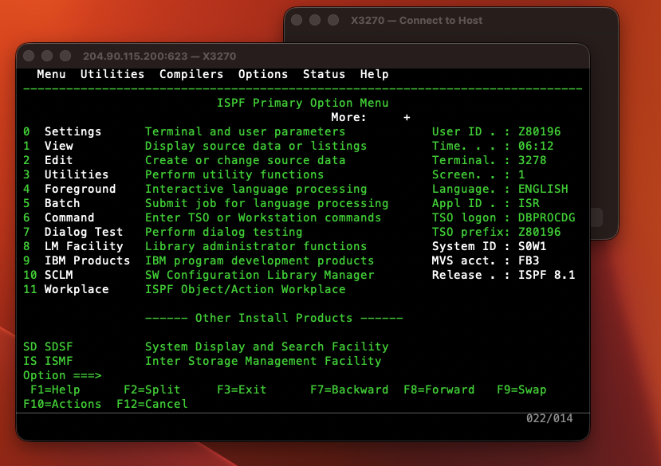

# X3270 — Free TN3270 Terminal Emulator for macOS

A native macOS (ARM - Apple Silicon + Intel) TN3270/TN3270E terminal emulator for connecting to IBM Mainframes (z/OS, z/VM, z/VSE).  
Built entirely in C++ and Objective-C++ on top of native Cocoa, CoreText and OpenSSL.  
**No license fee. No Java. No X11.**

---

## Why this exists

If you work with IBM Mainframes on a Mac, you've probably noticed that every halfway-decent TN3270 terminal client costs money — sometimes a *lot* of money. We're talking $50–$100+ for software that essentially emulates a 1970s text terminal. One popular commercial option charges a recurring subscription just to type on a green screen. That's absurd.

There are a handful of free alternatives, but they either require Java (slow, ugly, a security nightmare), run inside X11 (no thanks), or are abandonware that hasn't been touched in a decade and breaks on every macOS release.

So I built one from scratch. Native Cocoa. Native CoreText rendering. OpenSSL for TLS. Full TN3270E negotiation including ISPF Query Reply so the menus actually appear. It took a weekend of frustration and a lot of reading ancient IBM manuals — but the result is a clean, fast, free terminal that feels like it belongs on a Mac.

If you work in Mainframe and you're tired of paying for the privilege, this is for you.

---

## Screenshot



*ISPF 8.1 Primary Option Menu on z/OS — connected to IBM ZExplore mainframe at 204.90.115.200:623*

---

## Features

| Feature | Details |
|---|---|
| **Protocol** | TN3270E (RFC 2355) with automatic fallback to classic TN3270 |
| **Security** | Plain Telnet **and** implicit TLS (TLS 1.2+) on any port |
| **Screen models** | IBM 3278 Model 2 (24 × 80) |
| **EBCDIC code pages** | CP037 (US), CP500 (International), CP1047 (Open Systems) |
| **UI** | Native Cocoa window, green-on-black phosphor, 600 ms cursor blink |
| **Keyboard** | PF1–PF24, PA1–PA3, Clear, Reset, Tab/BackTab, ErEOF, Insert, arrows |
| **Query Reply** | Responds to IBM Structured Field Read Partition Query (required for ISPF) |
| **Rendering** | CoreText glyph metrics for pixel-perfect character grid |
| **macOS** | 12 Monterey and later (Apple Silicon + Intel) |

---

## Download

Pre-built DMG releases are available on the [**Releases**](https://github.com/el-dockerr/X3270/releases) page.
Every push to `main` automatically builds and publishes a new DMG via GitHub Actions.

1. Download `X3270-<version>.dmg`
2. Open the DMG and drag **X3270.app** to your `/Applications` folder
3. On first launch: right-click → **Open** (macOS Gatekeeper; the app is unsigned)

---

## Connecting to a Mainframe

1. Launch X3270 — the **Connect** dialog opens automatically
2. Fill in:
   | Field | Example |
   |---|---|
   | Host | `204.90.115.200` |
   | Port | `623` (plain) · `992` (TLS) · `23` (standard Telnet) |
   | SSL/TLS | check for encrypted connections |
   | CA Bundle | path to a PEM file if using a private CA (optional) |
   | Code Page | CP037 (US default) · CP500 · CP1047 |
3. Click **Connect**

The terminal window opens. Type your credentials at the logon screen. ISPF and TSO sessions are fully supported.

---

## Keyboard Map

| Key | 3270 Function |
|---|---|
| `F1`–`F12` | PF1–PF12 |
| `Shift`+`F1`–`F12` | PF13–PF24 |
| `Option`+`1`/`2`/`3` | PA1 / PA2 / PA3 |
| `Return` | Enter (AID) |
| `Escape` | Reset (unlock keyboard) |
| `Option`+`Escape` | Clear screen |
| `Tab` / `Shift`+`Tab` | Next / previous field |
| `Insert` | Toggle insert mode |
| `Option`+`Delete` | Erase to End of Field |
| `Option`+`E` | Erase Input (all unprotected fields) |
| `↑` `↓` `←` `→` | Cursor movement |

---

## Building from Source

### Prerequisites

```bash
# Xcode Command Line Tools
xcode-select --install

# Homebrew + OpenSSL
brew install openssl@3 cmake
```

### Build

```bash
git clone https://github.com/el-dockerr/X3270.git
cd X3270
cmake -B build -DCMAKE_BUILD_TYPE=Release
cmake --build build
open build/X3270.app
```

To set an explicit build number (useful in CI):

```bash
cmake -B build -DCMAKE_BUILD_TYPE=Release -DBUILD_NUMBER=42
cmake --build build
```

### Package a DMG for distribution

```bash
./package.sh
# produces: dist/X3270-1.0.0-build1.dmg
```

Pass an optional build number:

```bash
BUILD_NUMBER=42 ./package.sh
# produces: dist/X3270-1.0.0-build42.dmg
```

---

## Version History

### v1.0.2 — 2026-05-19

**Traffic Monitor panel**
- New floating **Traffic Monitor** window (Debug → Traffic Monitor, `⌘⇧D`) showing all raw inbound and outbound Telnet/TN3270 bytes as a colour-coded hex dump (TX blue, RX green) with timestamps, byte counts, and a printable ASCII column.
- **Clear** button wipes the log; **Save to File…** exports the full session as plain text.
- Captures traffic from the moment a connection is initiated so the full negotiation is always visible.

**TN3270 / z/VM protocol fixes**
- **Fixed: z/VM stuck at NVT "PRESS BREAK KEY TO BEGIN SESSION"** — The client was proactively sending `WILL BINARY`, `DO BINARY`, `WILL EOR`, `DO EOR` during the opening handshake. z/VM responds with `DONT BINARY` / `DONT EOR`, which per RFC 854 permanently disables those options for the session. z/VM then committed to NVT mode and never offered 3270 negotiation. Fix: remove proactive BINARY/EOR offers from `connect()`; let the server drive binary/EOR negotiation after the terminal-type exchange.
- **Fixed: Duplicate `WILL TN3270E` confusing TN3270E-capable servers** — When the server confirmed our initial `WILL TN3270E` by echoing `DO TN3270E`, the response handler was sending a second `WILL TN3270E`, causing some servers to reject TN3270E entirely. Fix: added `sentWillTN3270E_` / `sentDoTN3270E_` guards (same pattern as the existing `sentWillBinary_` guards).

**Other fixes**
- `WILL TN3270E` server offer not handled → fixed
- `enterDataMode()` guard was too strict (required `willBinary_`/`willEOR_`) → fixed
- Write command reset buffer address to 0 → fixed
- `FUNCTIONS REJECT` from server not handled → fixed
- Keyboard locked permanently after a failed AID send (`SendRecordCallback` now returns `bool`) → fixed
- Keyboard started unlocked instead of locked-while-connecting → fixed (`LockReason::Connecting` initial state)
- `DEVICE-TYPE REJECT` did not call `enterDataMode()` → fixed
- Duplicate `WILL`/`DO` for `BINARY`/`EOR` during re-negotiation → fixed (`sentXxx_` flags)
- `TERMINAL-TYPE SEND` sub-negotiation did not set `doTermType_` → fixed
- Query Reply was missing Colour and Highlighting structured fields (required for ISPF menus) → fixed

### v1.0.1 — 2026-05-13

**Initial public release** — basic TN3270E support, TLS support, ISPF Query Reply support, CoreText rendering, keyboard input, and a simple Connect dialog.


---

## License

X3270 for macOS is released under the **MIT License**.  
See [LICENSE](LICENSE) for the full text.

Written by Swen Kalski, 2026.

IBM, z/OS, ISPF, and 3270 are trademarks of IBM Corporation.  
This project is not affiliated with or endorsed by IBM.
